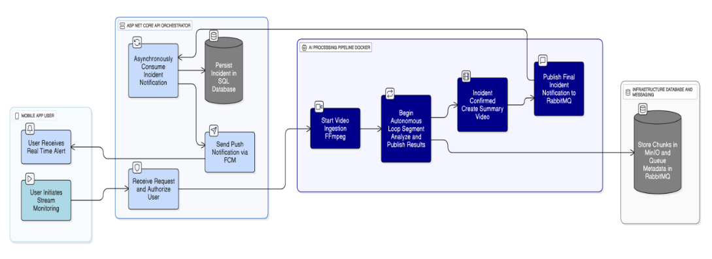
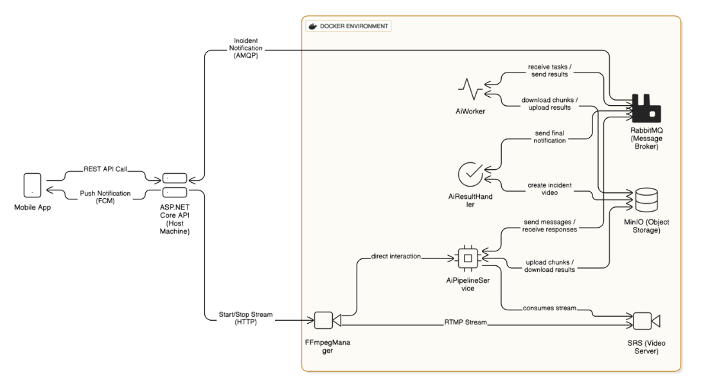

# Real-Time AI-Powered Violence Detection System

> A multi-service backend system that analyzes live video streams using a hybrid cloud/local AI pipeline to detect and report violent incidents in real-time.

---

## About The Project

This project was developed as my B.Sc. Graduation Project, where I acted as the technical lead and system architect for a 5-person team. The core challenge was to design a robust, scalable system capable of ingesting multiple live video streams and using AI to identify potential violence with minimal latency.

The system is architected as a set of containerized microservices orchestrated by a central .NET API. The most significant architectural achievement was designing a hybrid cloud/local pipeline to overcome hardware limitations, processing latency-sensitive tasks locally while leveraging a cloud GPU for complex classification.

**This repository contains the core ASP.NET API. The AI microservices are located in a separate repository linked below.**

### Key Features:
*   **Real-Time Data Pipeline:** Ingests live video streams and processes them into chunks for AI analysis using RabbitMQ and MinIO.
*   **Hybrid AI Processing:** A unique architecture that splits AI tasks between local and cloud resources to balance performance and cost.
*   **Microservice Architecture:** Decoupled, containerized Python services for scalability and maintainability.
*   **Secure RESTful API:** Built with ASP.NET Core for client communication, handling user authentication, camera management, and alert history.
*   **Real-Time Notifications:** Pushes alerts to a client application upon detection of an incident.

## Project Repositories

This project is composed of two essential repositories. Both must be cloned for the system to run correctly.

*   ➡️ **This Repository (Backend API):** `Real-Time-Violence-Detection-API`
    *   Contains the core ASP.NET API, database schema, and client-facing endpoints.
*   ➡️ **AI Microservices Repository:** [`Violence-Detection-AI-Services`](https://github.com/nourfarag1/VdectDockerContainers)
    *   Contains the containerized Python services for video processing and AI inference.

## Tech Stack

*   **Backend API:** C#, ASP.NET Core
*   **AI Services:** Python, Flask, OpenCV
*   **Data Pipeline:** RabbitMQ (Message Queue), MinIO (Object Storage)
*   **Stream Management:** Simple-RTMP-Server (SRS)
*   **Containerization:** Docker, Docker Compose
*   **Client (for demo):** Flutter

## System Architecture

The system is designed as a distributed set of services to handle the real-time processing demands. The architecture can be understood at two levels: the high-level process flow and the detailed component interaction.

### High-Level Process Flow

This diagram illustrates the end-to-end journey, from a user initiating a stream to receiving a real-time alert. It shows the clear separation of responsibilities between the mobile client, the .NET orchestrator, the AI pipeline, and the underlying infrastructure.



### Detailed Component Architecture

This diagram provides a more granular view of the services running within the Docker environment. It details the individual microservices, the specific communication protocols used (RTMP, AMQP, HTTP), and the flow of data between the message broker (RabbitMQ) and object storage (MinIO).



## Getting Started

To get a local copy up and running, follow these steps.

### Prerequisites

*   Docker and Docker Compose
*   .NET 8 SDK
*   Python 3.10

### Installation & Launch

1.  **Clone Both Repositories:** The system requires both the API and the AI services. It is recommended to clone them into the same parent directory.
    ```sh
    # Clone the Backend API (this repo)
    git clone https://github.com/nourfarag1/Real-Time-Violence-Detection-API.git

    # Clone the AI Microservices
    git clone https://github.com/nourfarag1/VdectDockerContainers.git
    ```
2.  **Configure Environment Variables:**
    *   Navigate into the `Real-Time-Violence-Detection-API` directory.
    *   Create a `.env` file by copying the provided `.env.example` file.
    *   Update the variables in the new `.env` file with your local configuration.
3.  **Launch the System with Docker Compose:**
    *   From the root of the `Real-Time-Violence-Detection-API` directory (where the `docker-compose.yml` file is located):
    ```sh
    docker-compose up --build
    ```
---
